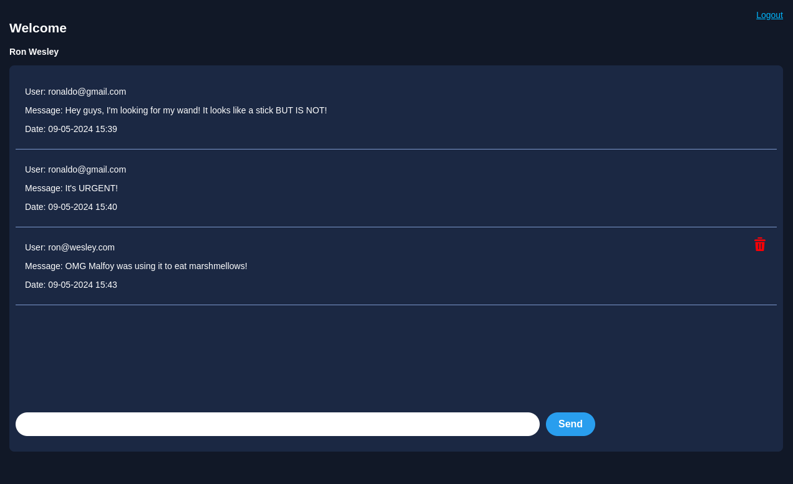
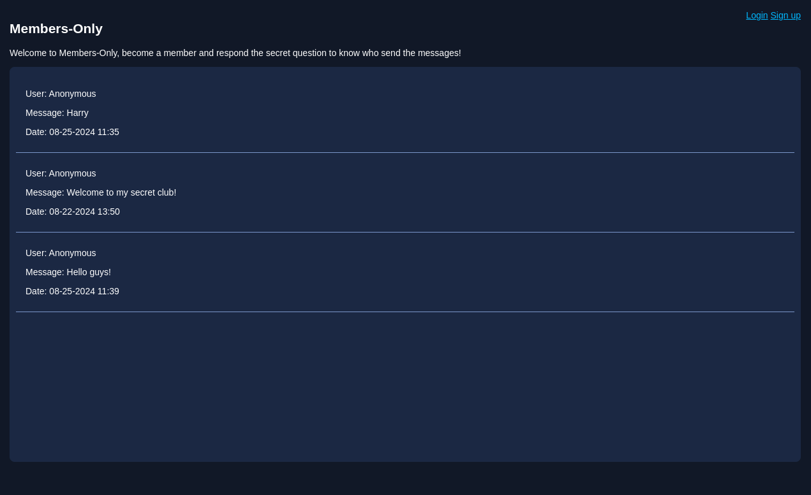
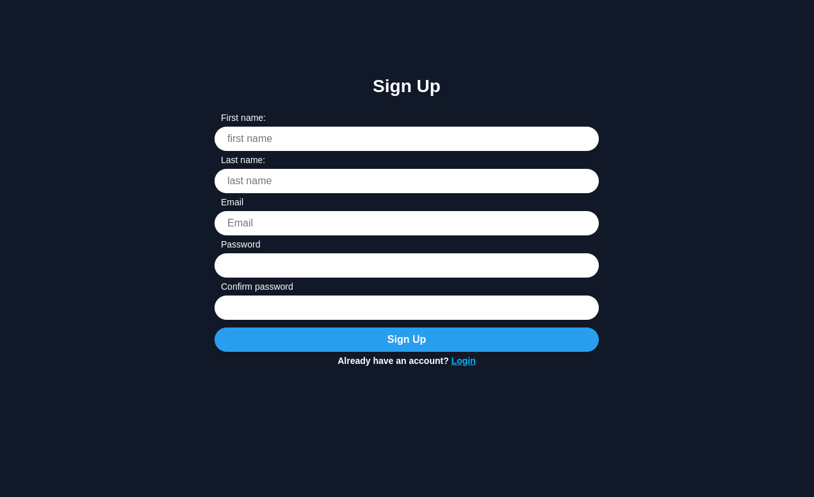

# [Members-Only](https://members-only-production-9476.up.railway.app/)
### A secret club for wizards 

Members-Only is a message board where only true friends can send messages, delete their own messages and discover who the authors are.

## 🛠️ Tools

- `NodeJs`
- `Express`
- `Postgresql`
- `Passport`
- `Ejs`

## About the Project

This is a Node/Express server-side rendering project and the goal of Members-Only is to allow only authorized people to interact, for this purpose this project has an authentication system made with passportJs. The form validation was made using express-validator, and all the data is stored in a postgresql database hosted on railway. For the Interfaces I used Ejs template engine and css.

With passport and express-session I was able to handle clients sessions, also bcrypt to handle passwords utilities. 

Deal with timezone differences was quite challenging, to avoid pollute the UI with a dropdown menu where the user should choose the timezone, I had to use geoip-lite and request-ip to track down the clients timezones.

###  [Linkedin](https://www.linkedin.com/in/diego-coura-18b88317b/)

